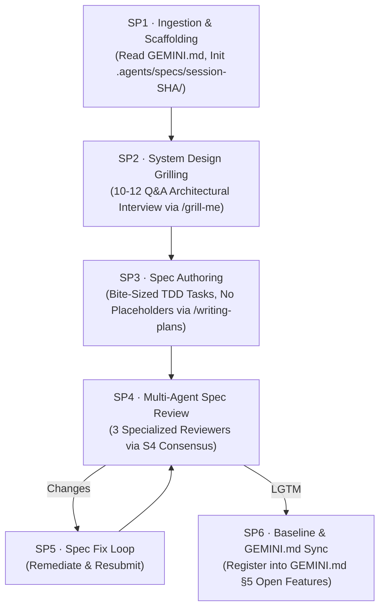

# Spec Architecture Pipeline — Invocation Guide

Use the template prompt below to trigger the autonomous **Spec Architecture Pipeline** (`spec-architect-pipeline`) in any chat session.
This pipeline conducts a deep 10–12 question system design interview (`/grill-me`), authors a production-grade specification with bite-sized TDD tasks (`/writing-plans`), subjects the plan to multi-agent peer review (`S4 Plan Review`), and links the certified spec into `.agents/specs/session-[SHA]/` and `GEMINI.md §5 Open Features`.

---

## 📋 Copyable Spec Invocation Prompt

```markdown
# INVOKE: spec-architect-pipeline (v1.2.0)

## 1. Feature Brief & High-Level Intent
- **Feature Name**: [INSERT KEBAB-CASE NAME, e.g. transaction-history]
- **Short Description**: [INSERT ONE-LINE DESCRIPTION]
- **Target Tech Stack**: [INSERT STACK, e.g. Java Spring Boot + PostgreSQL + Hibernate + Flyway]

## 2. Specification Lifecycle (SP1–SP6)



### Step-by-Step Execution Directives & Mandatory Files to Read

- **SP1 · Ingestion & Scaffolding** (Skill: `skills/spec-architect-pipeline/SKILL.md`):
  - Mandatory Files: `GEMINI.md`, `rules/AGENTS.md`, `skills/spec-architect-pipeline/SKILL.md`.
  - Scaffolding Script: `pwsh -File commands/init-spec-session.ps1 -Name [name]`.
- **SP2 · System Design Grilling (/grill-me)**:
  - Mandatory Rubric: `skills/spec-architect-pipeline/resources/spec-grill-rubric.md` (10–12 architectural interview dimensions).
  - Output Log: `.agents/specs/session-[SHA]/grill/grill-log.md`.
- **SP3 · Spec Authoring (/writing-plans)**:
  - Mandatory Schema: `skills/spec-architect-pipeline/resources/spec-template.md`, `resources/test-driven-development-guide.md`, `resources/error-handling-guide.md`.
  - Target Spec: `.agents/specs/session-[SHA]/YYYY-MM-DD_[name]_SPEC.md`.
- **SP4 · Multi-Agent Spec Review**:
  - Review Guidelines & Templates: `skills/spec-architect-pipeline/resources/spec-review-guide.md`, `resources/submit-template.md`, `resources/review-template.md`.
  - Reviewer Subagents: `agents/spec-system-architect-reviewer.md`, `agents/spec-security-edgecase-reviewer.md`, `agents/spec-testability-scale-reviewer.md`.
- **SP5 · Spec Fix Loop**:
  - Mandatory Findings: `.agents/specs/session-[SHA]/code-review/review/review(n).md`, `skills/spec-architect-pipeline/resources/spec-review-guide.md`, `resources/submit-template.md`.
- **SP6 · Baseline & GEMINI.md Sync**:
  - Automation Command: `pwsh -File commands/sync-spec-gemini.ps1 -Sha [SHA] -Title "[Title]" -Summary "[Summary]"`.
  - Target Document: `GEMINI.md` (§5 Open Features).

## 3. Non-Negotiable Invariants
1. Spec remains permanently isolated in `.agents/specs/session-[SHA]/`.
2. Do NOT copy the spec to external folders; link directly from the session directory.
3. Every task in the spec must follow Red-Green-Refactor with exact test commands.
4. Zero placeholders: no "TODO", "TBD", or "add validation".

---
**Directive**: Acknowledge feature brief, initialize `.agents/specs/session-[SHA]/`, and begin SP1.
```

---

## 🔗 Seamless Linking into S1–S11 Implementation

Once SP6 completes, the certified spec is isolated in `.agents/specs/session-[SHA]/` and is registered under `GEMINI.md §5 Open Features`.
To implement the feature, simply invoke the master S1–S11 workflow:

```markdown
# INVOKE: ideal-agentic-workflow (v1.2.0)

## 1. Operating Mode
- [x] **Standard**

## 2. Task Description
Implement feature according to certified spec at `.agents/specs/session-[SHA]/YYYY-MM-DD_[name]_SPEC.md`
```
