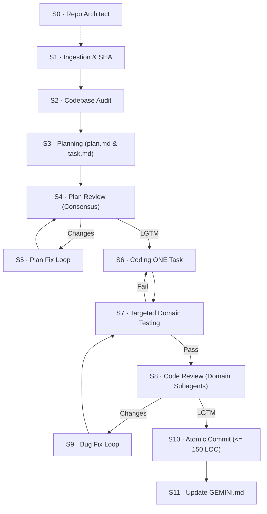

# Ideal Agentic Workflow — Invocation Guide

Use the template prompt below to trigger the `ideal-agentic-workflow` in any chat session.
Copy the block into your chat prompt, select your **Mode**, describe your **Task**, and optionally select steps to **Skip**.

---

## 📋 Copyable Workflow Invocation Prompt

```markdown
# INVOKE: ideal-agentic-workflow (v1.2.0)

## 1. Operating Mode (Select exactly one)
- [x] **Standard** — Full S1–S11 lifecycle. Rigorous multi-agent engineering. (Default)
- [ ] **/fast mode** — Single-task (<= 3 files, 100 LOC), 1 reviewer, audit bypass.
- [ ] **/trivial** — Docs/non-source changes only. Skips audit, review, and tests.
- [ ] **/duolithic mode** — Heavy review offloaded to parallel R-Agent conversation.

## 2. Task Description
<!-- Describe your task requirements, bug details, or feature spec here -->
[INSERT TASK DESCRIPTION HERE]

## 3. Skip List (Optional overrides)
- [ ] **S0 — Repo Architect** (Skip if GEMINI.md is already certified)
- [ ] **S2 — Codebase Audit** (Skip if audit.md exists and is <= 7 days old)
- [ ] **S4 — Plan Review** (Skip to proceed directly from plan to code)
- [ ] **S8 — Code Review** (Skip only if mode is /trivial)

*Fill in steps to skip this session (e.g., S0, S2):* None

## 4. Execution Lifecycle (S0–S11)



### Step-by-Step Execution Directives & Mandatory Files to Read

- **S0 · Repo Architect** (Skill: `skills/s0-repo-architect/SKILL.md`):
  - Mandatory Files: `skills/s0-repo-architect/schemas/gemini-prd-schema.json`, `skills/s0-repo-architect/schemas/anti-pattern-schema.json`, `skills/s0-repo-architect/templates/gemini-production-template.md`, `skills/s0-repo-architect/templates/directory-tree-explainer-template.txt`, `resources/gemini-template.md`.
  - Automated Scripts: `skills/s0-repo-architect/scripts/generate-ascii-tree.js`, `skills/s0-repo-architect/scripts/verify-gemini-schema.js`.
- **S1 · Ingestion & Scaffolding** (Skill: `skills/s1-orchestrator/SKILL.md`):
  - Mandatory Files: `GEMINI.md`, `rules/AGENTS.md`, `skills/s1-orchestrator/resources/session-init.md`, `resources/checklist-template.md`, `resources/stacks/_stack-composer.md`.
  - Operating Modes: `skills/s1-orchestrator/resources/fast-mode.md`, `skills/s1-orchestrator/resources/trivial-mode.md`, `skills/s1-orchestrator/resources/duolithic-mode.md`.
  - Command: `pwsh -File commands/init-session.ps1`.
- **S2 · Codebase Audit** (Skill: `skills/s2-codebase-audit/SKILL.md`):
  - Audit Guides & Schemas: `resources/audit-template.md`, `skills/s2-codebase-audit/resources/audit-compiler.md`, `skills/s2-codebase-audit/resources/fullstack-persona-bank.md`, `skills/s2-codebase-audit/resources/minecraft-persona-bank.md`.
  - Auditor Subagents: `agents/fullstack-architecture-auditor.md`, `agents/fullstack-security-reviewer.md`, `agents/fullstack-performance-seo-auditor.md`, `agents/fullstack-uiux-cro-auditor.md`, `agents/fullstack-test-quality-auditor.md`, `agents/postgres-hibernate-flyway-auditor.md`, `agents/mc-game-performance-auditor.md`, `agents/mc-mapping-compliance-auditor.md`, `agents/mc-mod-compatibility-auditor.md`, `agents/audit-compiler.md`.
- **S3 · Planning** (Skill: `skills/s3-planning/SKILL.md`):
  - Mandatory Schemas: `resources/plan-template.md`, `resources/task-template.md`, `skills/s3-planning/resources/priority-rubric.md`.
  - Inputs: `GEMINI.md §2-§5`, `.agents/session-[SHA]/audit.md`, `.agents/session-[SHA]/context.md`.
- **S4 · Plan Review** (Skill: `skills/s4-plan-review/SKILL.md`):
  - Review Guidelines & Templates: `agents/plan-critic.md`, `skills/s4-plan-review/resources/plan-review-guide.md`, `resources/submit-template.md`, `resources/review-template.md`.
  - Target Plans: `.agents/session-[SHA]/plan.md`, `.agents/session-[SHA]/task.md`.
- **S5 · Plan Fix Loop** (Skill: `skills/s5-plan-fix/SKILL.md`):
  - Mandatory Files: `.agents/session-[SHA]/code-review/review/review(n).md`, `skills/s4-plan-review/resources/plan-review-guide.md`, `resources/submit-template.md`.
- **S6 · Coding ONE Task** (Skill: `skills/s6-coding/SKILL.md`):
  - Global Invariants: `rules/AGENTS.md`, `resources/senior-dev-standards.md`, `resources/error-handling-guide.md`, `resources/test-driven-development-guide.md`.
  - Anti-Patterns & Stack Detection: `skills/s6-coding/resources/stack-detector.md`, `skills/s6-coding/resources/anti-patterns.md`.
  - Active Stack Rules & Packs: Detected from `resources/stacks/*.md` and `rules/rules-*.md`.
  - Specialist Subagents: `agents/*-specialist.md`.
- **S7 · Domain-Driven Targeted Testing** (Skill: `skills/s7-testing/SKILL.md`):
  - Mandatory Files: `skills/s7-testing/resources/test-commands.md`, `resources/test-driven-development-guide.md`, `rules/AGENTS.md` (AP-004).
  - Targeted Runner: `pwsh -File commands/verify-stack.ps1 -Target <DomainClass>`.
- **S8 · Code Review** (Skill: `skills/s8-code-review/SKILL.md`):
  - Routing Matrix & Guides: `skills/s8-code-review/resources/task-reviewer-matrix.md`, `skills/s8-code-review/resources/code-review-guide.md`, `resources/submit-template.md`, `resources/review-template.md`.
  - Reviewer Subagents: Matched from `agents/*-reviewer.md` (e.g. `agents/postgres-hibernate-flyway-reviewer.md`, `agents/fullstack-implementation-reviewer.md`, etc.).
- **S9 · Bug Fix Loop** (Skill: `skills/s9-bug-fix/SKILL.md`):
  - Mandatory Files: `.agents/session-[SHA]/code-review/review/review(n).md`, `skills/s8-code-review/resources/code-review-guide.md`, `rules/AGENTS.md`, `resources/error-handling-guide.md`, `resources/submit-template.md`.
  - Re-testing: Mandatory clean re-execution of `skills/s7-testing/SKILL.md`.
- **S10 · Atomic Commit** (Skill: `skills/s10-git-commit/SKILL.md`):
  - Commit Standards: `skills/s10-git-commit/resources/commit-examples.md`, `skills/s10-git-commit/resources/breaking-change-guide.md`, `skills/s10-git-commit/resources/commit-split-guide.md`, `hooks.json`.
  - Commands: `pwsh -File commands/measure-diff.ps1`, `pwsh -File commands/stage-commit.ps1`.
- **S11 · GEMINI.md Update & Loop Closure** (Skill: `skills/s11-gemini-update/SKILL.md`):
  - Documentation Schema & Suggester: `skills/s11-gemini-update/resources/gemini-schema.md`, `resources/gemini-template.md`, `skills/s11-gemini-update/resources/global-skill-suggester.md`, `GEMINI.md`.
  - Session Cleanup: `pwsh -File commands/clean-session.ps1`.

## 5. Non-Negotiable Invariants
1. Read `GEMINI.md` before touching any source file.
2. Quarantine all session state in `.agents/session-[SHA]/`.
3. Code exactly ONE task per S6->S7->S8 cycle.
4. Stage files explicitly per-file — never run `git add .` (AP-005).
5. Unanimous LGTM required for plan (S4) and code (S8).
6. Evidence before assertions: run actual test commands before claiming success.

---
**Directive**: Acknowledge mode and active stack, initialize `.agents/session-[SHA]/`, and begin S1.
```

---

## ⚡ Mode Cheat Sheet

| Mode | Trigger Keyword | Profile | Best For |
| :--- | :--- | :--- | :--- |
| **Standard Mode** | *(default)* | Full S1–S11 lifecycle with multi-agent audits and multi-reviewer consensus. | Core features, major refactors, complex bug fixes |
| **Fast Mode** | `/fast mode` | Single-task fixes ($\le 3$ files, 100 LOC), bypasses S2 if audit $\le 7$ days old, 1 reviewer. | Quick bug fixes, tight patches |
| **Trivial Mode** | `/trivial` | Documentation or chores only. Skips audit, review, and tests. Single commit. | Documentation, README, comments, chores |
| **Duolithic Mode** | `/duolithic mode` | Offloads heavy subagent reviews to an external conversation ("R-Agent"). | Context-constrained or large refactors |

---

## 🛠 Automation Commands

- `pwsh -File commands/init-session.ps1`: Initializes `.agents/session-[SHA]/` directory structure.
- `pwsh -File commands/measure-diff.ps1`: Measures git diff insertions and warns if > 150 lines.
- `pwsh -File commands/verify-stack.ps1 -Target <Class>`: Runs Tier 1-3 verification with domain-driven targeted tests.
- `pwsh -File commands/stage-commit.ps1`: Surgical per-file staging and Conventional Commit validator.
- `pwsh -File commands/clean-session.ps1`: Prunes and archives completed sessions safely.
