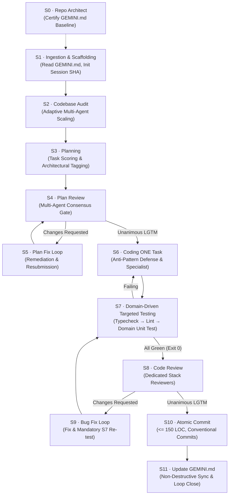
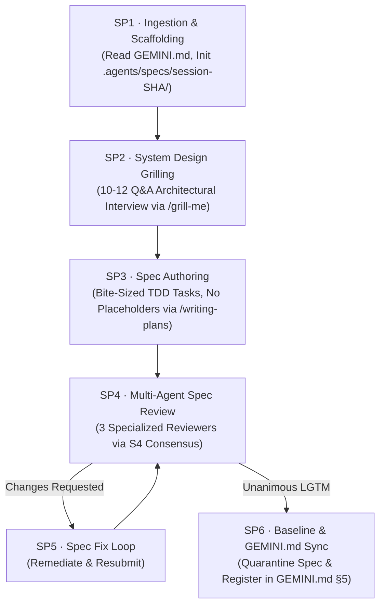

# ideal-agentic-workflow

<div align="center">

[](plugin.json)
[](https://github.com/RachitSWE)
[](https://antigravity.google)
[](scripts/verify-file-citations.js)
[](LICENSE.md)

**Enterprise-grade agentic engineering plugin for Google Antigravity.**  
*Eliminates "vibe coding" with deterministic multi-agent auditing, domain-driven testing, consensus review gates, atomic Conventional Commits, and automated specification pipelines.*

---

[Key Capabilities](#-key-capabilities) •
[S0–S11 Implementation Pipeline](#-s0s11-implementation-pipeline) •
[SP1–SP6 Spec Pipeline](#-sp1sp6-spec-architecture-pipeline) •
[Operating Modes](#-operating-modes) •
[Subagent Ecosystem](#-subagent-ecosystem-48-agents) •
[Stack Packs & Rules](#-technology-stack-packs--rules) •
[Automation Commands](#-automation-commands) •
[Verification Suite](#-verification--quality-suite) •
[License](#-license)

</div>

---

## ⚡ Key Capabilities

- **Dual Autonomous Pipelines**:
  - **S0–S11 Implementation Pipeline**: Full end-to-end software development lifecycle from repository discovery to monotonic `GEMINI.md` synchronization.
  - **SP1–SP6 Spec Architecture Pipeline**: Autonomous feature specification engine featuring interactive system design grilling (`/grill-me`), bite-sized TDD plans (`/writing-plans`), and multi-agent peer review (`S4`).
- **Domain-Driven Targeted Testing (DTT)**:
  - Accelerates inner-loop feature iterations by executing domain-filtered unit and slice tests (`mvn test -Dtest=...`, `vitest path`, etc.) rather than running hundreds of tests on every single commit. Full suite verification is strictly gated at S10 pre-commit.
- **48 Subagent Definitions**:
  - Full matrix of S2 auditors, S6 framework specialists, S8 code reviewers, and SP4 spec reviewers ensuring zero self-review and objective consensus.
- **Strict Anti-Pattern Defense (AP-001 – AP-008)**:
  - Eliminates mock data in production paths, narrative/conversational comments, compiler appeasement hacks (`@ts-ignore`, `any`), bulk staging (`git add .`), and state leakage outside `.agents/session-[SHA]/`.
- **Zero Token Spoofing**:
  - Modern, token-efficient Markdown and Mermaid diagrams replace legacy ASCII box drawings to preserve context windows.
- **Verified Link Integrity**:
  - 100% of all files, rules, resources, commands, and subagents are cited and validated with automated Node.js regression testing.

---

## 🏗 S0–S11 Implementation Pipeline

The core execution engine transforms feature briefs into verified, production-ready software through a deterministic 12-stage state machine:



### Stage Directives & Responsibilities

| Stage | Skill Name | Primary Responsibility |
| :--- | :--- | :--- |
| **S0** | [`s0-repo-architect`](skills/s0-repo-architect/SKILL.md) | Discovers codebase reality, pins tech stacks, compiles max-depth ASCII trees, and certifies `GEMINI.md`. |
| **S1** | [`s1-orchestrator`](skills/s1-orchestrator/SKILL.md) | Reads `GEMINI.md`, scans incomplete sessions, derives 6-char SHA, detects mode, and scaffolds session tree. |
| **S2** | [`s2-codebase-audit`](skills/s2-codebase-audit/SKILL.md) | Scales auditor subagents adaptively by repo size, inspects boundaries, and compiles master `audit.md`. |
| **S3** | [`s3-planning`](skills/s3-planning/SKILL.md) | Scores tasks mathematically (`Severity × Complexity × Deps`), generating `plan.md` and tagged `task.md`. |
| **S4** | [`s4-plan-review`](skills/s4-plan-review/SKILL.md) | Spawns `plan-critic` subagents to review plan architecture; gates coding on unanimous `LGTM`. |
| **S5** | [`s5-plan-fix`](skills/s5-plan-fix/SKILL.md) | Methodically resolves plan review criticisms, updating `plan.md` and `task.md` until consensus. |
| **S6** | [`s6-coding`](skills/s6-coding/SKILL.md) | Implements **exactly ONE task**, consults framework specialists, and enforces anti-pattern defenses. |
| **S7** | [`s7-testing`](skills/s7-testing/SKILL.md) | Executes 3-tier checks: Static Type Check $\to$ Lint $\to$ **Domain-Driven Targeted Unit Tests** (`-Dtest=...`). |
| **S8** | [`s8-code-review`](skills/s8-code-review/SKILL.md) | Dispatches stack-specific reviewers matched to task tag (`[backend]`, `[database]`, etc.) for consensus sign-off. |
| **S9** | [`s9-bug-fix`](skills/s9-bug-fix/SKILL.md) | Surgically remediates review findings, mandates 100% test re-pass via S7, and resubmits for LGTM. |
| **S10** | [`s10-git-commit`](skills/s10-git-commit/SKILL.md) | Verifies all tasks complete, runs full suite regression gate, enforces atomic sizing ($\le 150$ LOC), and stages per-file. |
| **S11** | [`s11-gemini-update`](skills/s11-gemini-update/SKILL.md) | Non-destructively synchronizes `GEMINI.md` Open Features and History, suggests global skills, and closes session. |

---

## 📐 SP1–SP6 Spec Architecture Pipeline

For complex, ambiguous, or greenfield features requiring thorough architectural design before code generation:



1. **SP1 · Ingestion & Scaffolding**: Reads `GEMINI.md`, checks past specs, and scaffolds `.agents/specs/session-[SHA]/` via [`commands/init-spec-session.ps1`](commands/init-spec-session.ps1).
2. **SP2 · System Design Grilling**: Conducts an interactive 10–12 question architectural interview (`/grill-me`) across APIs, transactions, data models, RFC 7807, caching, and auth.
3. **SP3 · Spec Authoring**: Authors a complete, production-grade specification (`/writing-plans`) with bite-sized TDD tasks (2–5 min each), zero placeholders, exact file paths, and targeted test commands.
4. **SP4 · Multi-Agent Spec Review**: Spawns 3 specialized reviewers (`spec-system-architect-reviewer`, `spec-security-edgecase-reviewer`, `spec-testability-scale-reviewer`) requiring unanimous `LGTM`.
5. **SP5 · Spec Fix Loop**: Iteratively addresses reviewer criticisms in the draft spec until approved.
6. **SP6 · Baseline & GEMINI.md Sync**: Quarantines the certified spec inside `.agents/specs/session-[SHA]/`, syncs it to `GEMINI.md §5 Open Features` via [`commands/sync-spec-gemini.ps1`](commands/sync-spec-gemini.ps1), and outputs the S1–S11 invocation snippet.

---

## ⚡ Operating Modes

The workflow adjusts its execution overhead dynamically based on the session trigger:

| Mode | Trigger Keyword | Profile & Behavior | Ideal Use Cases |
| :--- | :--- | :--- | :--- |
| **Standard Mode** | *(default)* | Full S1–S11 lifecycle with multi-agent audits and multi-reviewer consensus. | Core features, major refactors, complex bug fixes |
| **Fast Mode** | `/fast mode` | Single-task fixes ($\le 3$ files, 100 LOC), bypasses S2 if audit $\le 7$ days old, spawns 1 reviewer. | Quick bug fixes, tight patches |
| **Trivial Mode** | `/trivial` | Documentation or chores only. Skips audit, review, and tests. Single `docs`/`chore` commit. | Documentation, README updates, comments, chores |
| **Duolithic Mode** | `/duolithic mode` | Offloads heavy subagent reviews to an external conversation ("R-Agent") to preserve context window. | Large codebases, massive refactors, deep reviews |

---

## 🤖 Subagent Ecosystem (48 Agents)

All subagents conform to the Antigravity specification in [`agents/`](agents/):

### 1. Orchestration, Planning & Spec Reviewers
- [`agents/plan-critic.md`](agents/plan-critic.md): Evaluates implementation plans for architectural soundness and testability.
- [`agents/audit-compiler.md`](agents/audit-compiler.md): Synthesizes distributed auditor findings into master `audit.md`.
- [`agents/_persona-creator.md`](agents/_persona-creator.md): Scaffolds custom subagent personas for unmapped stacks.
- [`agents/spec-system-architect-reviewer.md`](agents/spec-system-architect-reviewer.md): Reviews specification system boundaries, models, and interfaces.
- [`agents/spec-security-edgecase-reviewer.md`](agents/spec-security-edgecase-reviewer.md): Audits spec security postures, auth flows, and edge conditions.
- [`agents/spec-testability-scale-reviewer.md`](agents/spec-testability-scale-reviewer.md): Validates spec TDD tasks, observability, and scaling characteristics.

### 2. S2 Codebase Auditors
- [`agents/fullstack-architecture-auditor.md`](agents/fullstack-architecture-auditor.md): Audits module coupling, boundaries, and circular dependencies.
- [`agents/fullstack-security-reviewer.md`](agents/fullstack-security-reviewer.md): Scrutinizes auth, input sanitization, injection, and secret leakage.
- [`agents/fullstack-performance-seo-auditor.md`](agents/fullstack-performance-seo-auditor.md): Evaluates Core Web Vitals, SSR/SSG rendering, and bundle sizes.
- [`agents/fullstack-uiux-cro-auditor.md`](agents/fullstack-uiux-cro-auditor.md): Validates WCAG 2.1 AA accessibility and conversion patterns.
- [`agents/fullstack-test-quality-auditor.md`](agents/fullstack-test-quality-auditor.md): Inspects assertion quality, flakiness, and test coverage gaps.
- [`agents/postgres-hibernate-flyway-auditor.md`](agents/postgres-hibernate-flyway-auditor.md): Audits Flyway migrations, sequence IDs, lazy fetching, and OSIV.
- [`agents/mc-game-performance-auditor.md`](agents/mc-game-performance-auditor.md): Evaluates 20 TPS tick rate, memory leaks, and entity tick loops.
- [`agents/mc-mapping-compliance-auditor.md`](agents/mc-mapping-compliance-auditor.md): Ensures Mojang/Yarn symbol parity across Minecraft versions.
- [`agents/mc-mod-compatibility-auditor.md`](agents/mc-mod-compatibility-auditor.md): Detects Mixin collisions and registry conflicts.

### 3. S6 Framework Specialist Personas
- [`agents/nextjs-turborepo-specialist.md`](agents/nextjs-turborepo-specialist.md): Next.js 15, Turborepo, RSC boundaries, Server Actions.
- [`agents/spring-boot-specialist.md`](agents/spring-boot-specialist.md): Java Spring Boot 3+, Spring Security, Transactions, Data JPA.
- [`agents/python-ai-specialist.md`](agents/python-ai-specialist.md): Python, FastAPI, LangChain, PyTorch, RAG Pipelines.
- [`agents/rust-systems-specialist.md`](agents/rust-systems-specialist.md): Rust, Tokio async, Axum, Serde, memory safety.
- [`agents/database-postgres-prisma-specialist.md`](agents/database-postgres-prisma-specialist.md): PostgreSQL, Prisma schema, transactions, migrations.
- [`agents/database-mongo-redis-specialist.md`](agents/database-mongo-redis-specialist.md): MongoDB, Redis caching, indexing, TTLs.
- [`agents/mc-fabric-specialist.md`](agents/mc-fabric-specialist.md): Minecraft Fabric, Loom, Yarn mappings, Mixin architecture.
- [`agents/mc-neoforge-specialist.md`](agents/mc-neoforge-specialist.md): Minecraft NeoForge, ModDevGradle, Parchment, DeferredRegister.

### 4. S8 Stack-Specific Code Reviewers
- [`agents/fullstack-implementation-reviewer.md`](agents/fullstack-implementation-reviewer.md): Primary implementation reviewer evaluating AP-001 through AP-004.
- [`agents/postgres-hibernate-flyway-reviewer.md`](agents/postgres-hibernate-flyway-reviewer.md): Enforces Flyway immutability, `ddl-auto=validate`, sequence keys, and disabled OSIV.
- [`agents/nextjs-turborepo-reviewer.md`](agents/nextjs-turborepo-reviewer.md): Enforces App Router RSC boundaries, Server Actions, and client bundle limits.
- [`agents/spring-boot-reviewer.md`](agents/spring-boot-reviewer.md): Enforces transaction boundaries, DTO mapping, SecurityFilterChain, and RFC 7807.
- [`agents/python-ai-reviewer.md`](agents/python-ai-reviewer.md): Enforces non-blocking event loops, vector parity, Pydantic v2, and pinned versions.
- [`agents/rust-systems-reviewer.md`](agents/rust-systems-reviewer.md): Enforces Tokio async hygiene, zero unwrap/expect in production, and lock safety.
- [`agents/postgres-prisma-reviewer.md`](agents/postgres-prisma-reviewer.md): Enforces Prisma N+1 defense, over-fetching limits, and transaction atomicity.
- [`agents/mongo-redis-reviewer.md`](agents/mongo-redis-reviewer.md): Enforces NoSQL injection defense, mandatory Redis TTLs, and keyspace namespacing.
- [`agents/mc-fabric-reviewer.md`](agents/mc-fabric-reviewer.md): Enforces client/server isolation, zero `@Overwrite` mixins, and 20 TPS constraints.
- [`agents/mc-neoforge-reviewer.md`](agents/mc-neoforge-reviewer.md): Enforces `DeferredRegister` mandate and `Dist.CLIENT` separation.

---

## 📦 Technology Stack Packs & Rules

Each supported ecosystem provides paired stack pack specifications ([`resources/stacks/`](resources/stacks/)) and enforceable invariant rule charters ([`rules/`](rules/)):

| Technology Stack | Stack Pack | Enforceable Rule Charter |
| :--- | :--- | :--- |
| **PostgreSQL + Hibernate + Flyway** | [`database-postgres-hibernate-flyway.md`](resources/stacks/database-postgres-hibernate-flyway.md) | [`rules-database-postgres-hibernate-flyway.md`](rules/rules-database-postgres-hibernate-flyway.md) |
| **Next.js & Turborepo** | [`web-nextjs-turborepo.md`](resources/stacks/web-nextjs-turborepo.md) | [`rules-web-nextjs-turborepo.md`](rules/rules-web-nextjs-turborepo.md) |
| **Java Spring Boot** | [`web-backend-java-spring.md`](resources/stacks/web-backend-java-spring.md) | [`rules-web-backend-java-spring.md`](rules/rules-web-backend-java-spring.md) |
| **Python AI & RAG Backend** | [`web-backend-python-ai.md`](resources/stacks/web-backend-python-ai.md) | [`rules-web-backend-python-ai.md`](rules/rules-web-backend-python-ai.md) |
| **Rust Systems & Backend** | [`web-backend-rust.md`](resources/stacks/web-backend-rust.md) | [`rules-web-backend-rust.md`](rules/rules-web-backend-rust.md) |
| **PostgreSQL + Prisma** | [`database-postgres-prisma.md`](resources/stacks/database-postgres-prisma.md) | [`rules-database-postgres-prisma.md`](rules/rules-database-postgres-prisma.md) |
| **MongoDB + Redis** | [`database-mongo-redis.md`](resources/stacks/database-mongo-redis.md) | [`rules-database-mongo-redis.md`](rules/rules-database-mongo-redis.md) |
| **Minecraft Fabric** | [`mc-fabric.md`](resources/stacks/mc-fabric.md) | [`rules-mc-fabric.md`](rules/rules-mc-fabric.md) |
| **Minecraft NeoForge** | [`mc-neoforge.md`](resources/stacks/mc-neoforge.md) | [`rules-mc-neoforge.md`](rules/rules-mc-neoforge.md) |
| **Stack Composer Engine** | [`_stack-composer.md`](resources/stacks/_stack-composer.md) | [`AGENTS.md`](rules/AGENTS.md) |
| **Stack Pack Extensibility** | [`_stack-pack-creator.md`](resources/stacks/_stack-pack-creator.md) | [`AGENTS.md`](rules/AGENTS.md) |

---

## 🛡️ Anti-Patterns Guarded (AP-001 – AP-008)

All agents, auditors, and reviewers actively detect and reject violations of the core invariants in [`rules/AGENTS.md`](rules/AGENTS.md) and [`skills/s6-coding/resources/anti-patterns.md`](skills/s6-coding/resources/anti-patterns.md):

- **`AP-001` · Zero Simulation & Mock Code**: Absolute ban on mock return values, hardcoded sample JSON, or simulated delays in production paths. Mocks belong exclusively in test suites.
- **`AP-002` · Zero Conversational Comments**: Absolute ban on narrative comments (`// Added as per user instructions`, `// Modified to fix null pointer`).
- **`AP-003` · Zero Lingering Stubs**: Absolute ban on `TODO`, `FIXME`, `pass`, or `throw new UnsupportedOperationException()`.
- **`AP-004` · Zero Compiler Appeasement**: Absolute ban on disabling compiler checks (`any`, `@ts-ignore`, `# noqa`, empty `catch (Exception e) {}`).
- **`AP-005` · Zero Bulk Staging**: Absolute ban on `git add .` or `git add -A`. Staging MUST be performed surgically per-file (`git add <file>`).
- **`AP-006` · Zero Context Exhaustion**: Absolute ban on dumping monolithic source files into prompts; targeted diffs and line ranges only.
- **`AP-007` · Zero State Leakage**: All session state, stubs, and reviews are quarantined strictly inside `.agents/session-[SHA]/`.
- **`AP-008` · Zero Destructive Document Mutations**: Strict append-only, non-destructive editing protocol for `GEMINI.md` and user documentation.

---

## 🛠 Automation Commands

Cross-platform PowerShell automation scripts located in [`commands/`](commands/):

| Script | Purpose & Capabilities |
| :--- | :--- |
| [`commands/init-session.ps1`](commands/init-session.ps1) | Scaffolds `.agents/session-[SHA]/` directory tree, stubs, and checklist in milliseconds. |
| [`commands/init-spec-session.ps1`](commands/init-spec-session.ps1) | Scaffolds `.agents/specs/session-[SHA]/` for the Spec Architecture Pipeline. |
| [`commands/verify-stack.ps1`](commands/verify-stack.ps1) | Executes multi-tier verification (typecheck, lint, targeted unit tests) with `-Target <Class>` support. |
| [`commands/measure-diff.ps1`](commands/measure-diff.ps1) | Measures git diff insertions, modified file counts, and alerts if commit exceeds $\le 150$ LOC budget. |
| [`commands/stage-commit.ps1`](commands/stage-commit.ps1) | Performs surgical per-file staging, validates Conventional Commit syntax, and verifies mandatory bodies. |
| [`commands/sync-spec-gemini.ps1`](commands/sync-spec-gemini.ps1) | Non-destructively links certified specs from `.agents/specs/` into `GEMINI.md §5 Open Features`. |
| [`commands/clean-session.ps1`](commands/clean-session.ps1) | Safely archives completed sessions into `.agents/archive/` and prunes stale directories. |

---

## 🚀 How to Invoke

Copy the formatted invocation prompt into your chat session to begin:

- **For Feature Implementation (S0–S11)**: Refer to [**`INVOCATION.md`**](INVOCATION.md) (or [`resources/workflow-invocation-prompt.md`](resources/workflow-invocation-prompt.md)).
- **For Feature Specification (SP1–SP6)**: Refer to [**`INVOCATION-SPEC.md`**](INVOCATION-SPEC.md) (or [`resources/spec-invocation-prompt.md`](resources/spec-invocation-prompt.md)).

---

## 🧪 Verification & Quality Suite

The plugin includes an autonomous Node.js regression test suite verifying 100% citation coverage and link validity:

```bash
node scripts/verify-file-citations.js
```

### Verification Checks Enforced:
1. **Zero Broken Citations**: Validates that all relative file paths cited physically exist on disk (125+ unique paths verified).
2. **Subagent Coverage**: Validates that all 48 subagent definitions in `agents/` are cited and accessible.
3. **Rule Coverage**: Validates that all 10 invariant rules in `rules/` are cited.
4. **Stack Pack Coverage**: Validates that all 11 stack packs in `resources/stacks/` are cited.
5. **Command Script Coverage**: Validates that all 7 PowerShell automation scripts in `commands/` are cited.
6. **Auxiliary Resources**: Validates that all 28 skill-local schemas, scripts, and templates are cited.
7. **Token Efficiency**: Validates that invocation prompts contain 0 heavy ASCII box drawing characters.

---

## 📄 License

This software and its documentation are licensed under the **All Rights Reserved License**.  
See the [**`LICENSE.md`**](LICENSE.md) file for complete terms and restrictions.

Copyright (c) 2026 RachitSWE. All rights reserved.
