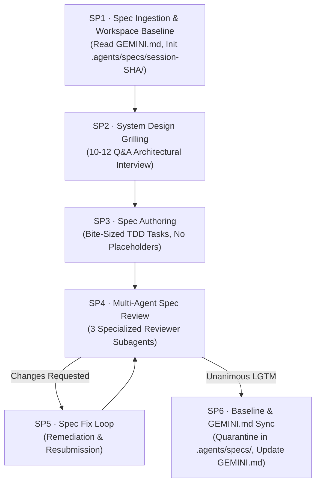

# Spec Architecture Pipeline (SP1–SP6)

## 1. Introduction and Purpose
This document defines the strict execution protocol for the **Spec Architecture Pipeline** (`spec-architect-pipeline`) within the `ideal-agentic-workflow` plugin.
This specialized pipeline transforms high-level feature requirements into airtight, production-ready specifications stored in `.agents/specs/session-[SHA]/`.
It combines three world-class engineering workflows:
1. **Interactive Grilling** (`/grill-me`): 10–12 structured system design & architecture questions using the `ask_question` tool.
2. **Deep Spec Authoring** (`/writing-plans`): Complete, bite-sized tasks, zero placeholders, complete code blocks, and TDD test sequences.
3. **Multi-Agent Spec Review** (`S4 Plan Review`): Independent peer review by three specialized subagents requiring unanimous `LGTM` consensus before certification.
4. **GEMINI.md Integration**: Automatic registration of the certified spec into `GEMINI.md §5 Open Features` for immediate execution by the S1–S11 workflow.

---

## 2. Directory Structure & Session Quarantine

All spec generation state is quarantined inside `.agents/specs/session-[SHA]/`:

```text
.agents/specs/session-[SHA]/
├── context.md                               # Ingested repository stack & context
├── grill/
│   └── grill-log.md                         # 10-12 Q&A system design decisions
├── code-review/
│   ├── submit/
│   │   └── submit(n).md                     # Spec submission payloads
│   └── review/
│       ├── review(1).md                     # System Architect review
│       ├── review(2).md                     # Security & Edge-Case review
│       └── review(3).md                     # Testability & Scale review
├── draft-spec.md                            # Working draft of the specification
├── CHECKLIST.md                             # Phase progress checklist
└── YYYY-MM-DD_[feature_name]_SPEC.md        # Final certified specification
```

---

## 3. Mandatory Files to Read at this Step

Before and during execution of the Spec Architecture Pipeline, the agent MUST explicitly read:
1. **Pipeline Specifications & Prompts**:
   - `skills/spec-architect-pipeline/resources/spec-grill-rubric.md` (10-12 architectural dimensions grilling rubric)
   - `skills/spec-architect-pipeline/resources/spec-template.md` (Canonical specification document schema)
   - `skills/spec-architect-pipeline/resources/spec-review-guide.md` (Multi-agent review criteria and scoring rubric)
   - `resources/spec-invocation-prompt.md` (or `INVOCATION-SPEC.md`, copyable pipeline prompt)
2. **Spec Reviewer Subagents**:
   - `agents/spec-system-architect-reviewer.md` (System boundaries, domain modeling, contract hygiene)
   - `agents/spec-security-edgecase-reviewer.md` (OWASP risks, auth flows, idempotency, failure modes)
   - `agents/spec-testability-scale-reviewer.md` (TDD breakdown, test pyramid, observability, throughput)
3. **Automation Commands**:
   - `commands/init-spec-session.ps1` (Spec session scaffolding script)
   - `commands/sync-spec-gemini.ps1` (Spec synchronization to GEMINI.md §5 Open Features)
4. **Primary Project Specification**:
   - `GEMINI.md` (PRD Section 2 Architecture, Section 3 Stack, and Section 5 Open Features)

---

## 4. The SP1–SP6 Phased Lifecycle



---

### SP1: Spec Ingestion & Baseline Context
1. **Read GEMINI.md**: Read `GEMINI.md` in full to determine technology stack, current architectural baseline, and existing open features.
2. **Scan Existing Specs**: Check `GEMINI.md §5 Open Features` and `.agents/specs/` to ensure naming consistency and avoid duplicating existing specifications.
3. **Generate 6-Char SHA**: Generate a unique session SHA from the timestamp.
4. **Scaffold Directory**:
   Run `pwsh -File commands/init-spec-session.ps1 -Sha [SHA] -Name [feature-name]`
5. **Write `context.md`**: Summarize the detected stack, conventions, and high-level goal.

---

### SP2: Interactive System Design Grilling (/grill-me)
1. Read `skills/spec-architect-pipeline/resources/spec-grill-rubric.md`.
2. Interview the user through the **10–12 architectural dimensions** using the `ask_question` tool:
   - Feature Scope & Boundaries
   - API Protocol & Interface Contracts
   - Data Models & Persistence Provider
   - Transaction Boundaries & Concurrency Isolation
   - Caching Topology & Invalidation Strategy
   - Security Boundaries & Input Sanitization
   - Error Handling & RFC 7807 Standard
   - Asynchronous Jobs & Event Bus
   - Database Migration & Schema Evolution
   - TDD Verification Strategy
   - Deployment & Backward Compatibility
3. For every question, present the recommended architectural choice first, explaining the rationale based on `GEMINI.md`.
4. Log all agreed decisions to `.agents/specs/session-[SHA]/grill/grill-log.md`.

---

### SP3: Spec Authoring (/writing-plans)
1. Read `skills/spec-architect-pipeline/resources/spec-template.md`.
2. Synthesize the user's responses from `grill-log.md` into a formal specification:
   `.agents/specs/session-[SHA]/YYYY-MM-DD_[feature_name]_SPEC.md`.
3. **Strict Writing Invariants**:
   - **Bite-Sized Granularity**: Every task is broken into 2–5 minute steps (Failing test -> Run fail -> Implement -> Run pass -> Commit).
   - **Zero Placeholders**: Absolute ban on "TODO", "TBD", "add validation", or generic summaries.
   - **Exact Paths & Real Code**: Specify exact relative file paths, complete code blocks, and actual test assertions.
   - **Targeted Test Commands**: Specify exact domain-driven test execution commands (e.g., `mvn test -Dtest={Service}Test`).

---

### SP4: Multi-Agent Spec Review (S4 Quality Gate)
1. Prepare submission payload:
   Write `.agents/specs/session-[SHA]/code-review/submit/submit(0).md` containing the draft spec and `skills/spec-architect-pipeline/resources/spec-review-guide.md`.
2. Spawn **three independent reviewer subagents** via `invoke_subagent`:
   - `agents/spec-system-architect-reviewer.md`
   - `agents/spec-security-edgecase-reviewer.md`
   - `agents/spec-testability-scale-reviewer.md`
3. Wait for all subagents to write their reports to `.agents/specs/session-[SHA]/code-review/review/review(n).md`.
4. **Consensus Rule**:
   - If ALL reviewers emit `LGTM`: Advance to SP6.
   - If ANY reviewer emits `CHANGES_REQUESTED`: Advance to SP5.

---

### SP5: Spec Fix Loop
1. Read all reviewer criticisms in `review(n).md`.
2. Methodically revise `.agents/specs/session-[SHA]/YYYY-MM-DD_[feature_name]_SPEC.md` to address every point of feedback.
3. Write `submit(n+1).md` detailing the fix changelog.
4. Resubmit to the reviewing subagents until unanimous `LGTM` is achieved.

---

### SP6: Baseline & Sync to GEMINI.md
1. **Certify Spec**:
   The canonical specification remains permanently isolated in:
   `.agents/specs/session-[SHA]/YYYY-MM-DD_[feature_name]_SPEC.md`.
2. **Sync GEMINI.md §5 Open Features**:
   Run `pwsh -File commands/sync-spec-gemini.ps1 -Sha [SHA] -Title "[Title]" -Summary "[Summary]"`
   Non-destructively appends the new feature to `GEMINI.md`:
   ```markdown
   - [ ] **[Feature Name]**: [One-line summary] (Spec: [.agents/specs/session-[SHA]/YYYY-MM-DD_[name]_SPEC.md](.agents/specs/session-[SHA]/YYYY-MM-DD_[name]_SPEC.md))
   ```
3. **Emit Implementation Handoff**:
   Present the user with the exact S1–S11 copyable invocation snippet pointing to `.agents/specs/session-[SHA]/YYYY-MM-DD_[feature_name]_SPEC.md`.
