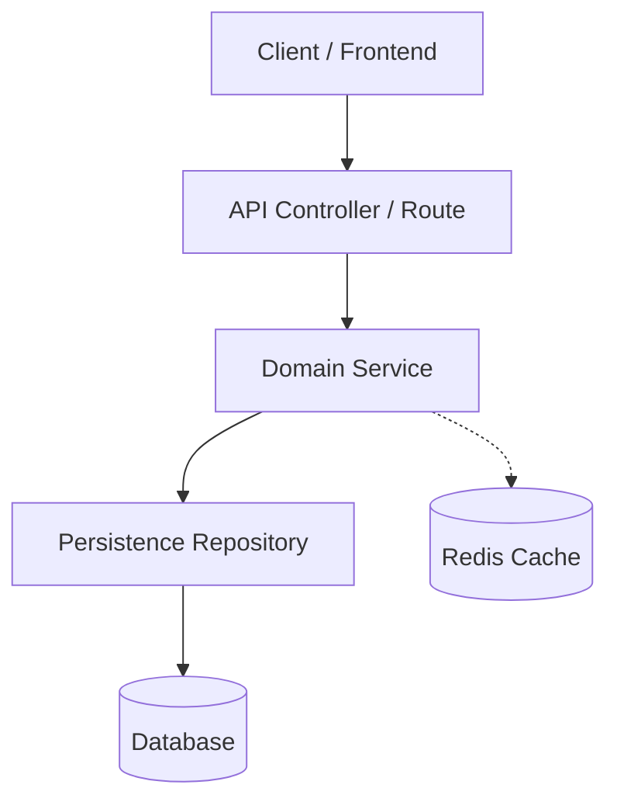

# [Feature Name] Feature Specification

> **Specification Metadata**  
> - **Date**: YYYY-MM-DD  
> - **Author**: Senior Spec Architect  
> - **Session SHA**: [SHA]  
> - **Status**: APPROVED (LGTM by Multi-Agent Consensus)  
> - **Target Execution Pipeline**: S1–S11 `ideal-agentic-workflow` (`.agents/session-[SHA]/`)  
> - **Canonical Path**: `.agents/specs/session-[SHA]/YYYY-MM-DD_[name]_SPEC.md`

---

## 1. Executive Summary & Goal
[One to two paragraphs describing the high-level purpose of the feature, business problem solved, and expected system behavior.]

---

## 2. System Architecture & Component Diagram



[Detailed explanation of the component interactions, lifecycle, and data flow.]

---

## 3. Data Models & Database Schemas

### 3.1 Entity / Table Schema
```sql
-- Flyway / SQL DDL or Schema definition
CREATE TABLE example_entity (
    id BIGINT PRIMARY KEY,
    name VARCHAR(255) NOT NULL,
    version BIGINT NOT NULL DEFAULT 0,
    created_at TIMESTAMP WITH TIME ZONE NOT NULL DEFAULT NOW()
);

CREATE INDEX idx_example_entity_name ON example_entity(name);
```

### 3.2 Relationships & Cardinality
- `ExampleEntity` (1) ── (N) `ChildEntity` (Lazy Fetching enforced)

---

## 4. API Contracts & Protocol Specifications

### 4.1 Endpoint: `POST /api/v1/resource`
- **Description**: Creates a new resource.
- **Request Headers**: `Content-Type: application/json`, `Authorization: Bearer <token>`
- **Request Body**:
  ```json
  {
    "name": "example",
    "amount": 100.50
  }
  ```
- **Response 201 Created**:
  ```json
  {
    "id": 1,
    "name": "example",
    "amount": 100.50,
    "createdAt": "2026-10-04T12:00:00Z"
  }
  ```
- **Response 400 Bad Request (RFC 7807)**:
  ```json
  {
    "type": "about:blank",
    "title": "Validation Failure",
    "status": 400,
    "detail": "Amount must be greater than zero"
  }
  ```

---

## 5. Security & Threat Model
- **Authentication**: JWT validation via SecurityFilterChain / NextAuth.
- **Authorization**: Role-based access control checking tenant and owner IDs.
- **Sanitization**: Input schema validation before reaching the service layer.
- **Concurrency**: Optimistic locking (`@Version`) prevents lost updates on concurrent modifications.

---

## 6. Verification & Test Strategy
- **Domain-Driven Targeted Testing**:
  - Unit tests for domain models and business calculations.
  - Slice tests for repository queries and transactions.
  - Integration tests for end-to-end endpoint verification.
- **Canonical Test Execution Command**:
  `mvn test -Dtest=ResourceServiceTest` (or equivalent for stack)

---

## 7. Bite-Sized Implementation Plan (TDD Red-Green-Refactor)

> Each task is atomic, bite-sized (2-5 minutes), and contains exact file paths and code snippets. NO PLACEHOLDERS.

### Task 1: [Component Name]
**Files:**
- Create: `src/main/resources/db/migration/V20261004120000__create_resource_table.sql`
- Create: `src/main/java/com/example/domain/Resource.java`
- Test: `src/test/java/com/example/domain/ResourceTest.java`

- [ ] **Step 1: Write the failing test**
```java
@Test
void should_create_resource_with_valid_parameters() {
    Resource resource = new Resource("Test", BigDecimal.TEN);
    assertThat(resource.getName()).isEqualTo("Test");
}
```

- [ ] **Step 2: Run test to verify it fails**
Command: `mvn test -Dtest=ResourceTest`
Expected: FAIL (Class `Resource` not found)

- [ ] **Step 3: Implement minimal code**
```java
public class Resource {
    // concrete implementation
}
```

- [ ] **Step 4: Run test to verify it passes**
Command: `mvn test -Dtest=ResourceTest`
Expected: PASS

- [ ] **Step 5: Stage and commit atomically**
Command: `pwsh -File commands/stage-commit.ps1 -Files @("src/main/java/com/example/domain/Resource.java", "src/test/java/com/example/domain/ResourceTest.java") -Type feat -Scope resource -Subject "create resource domain entity" -Body "initial domain entity definition with validation"`
